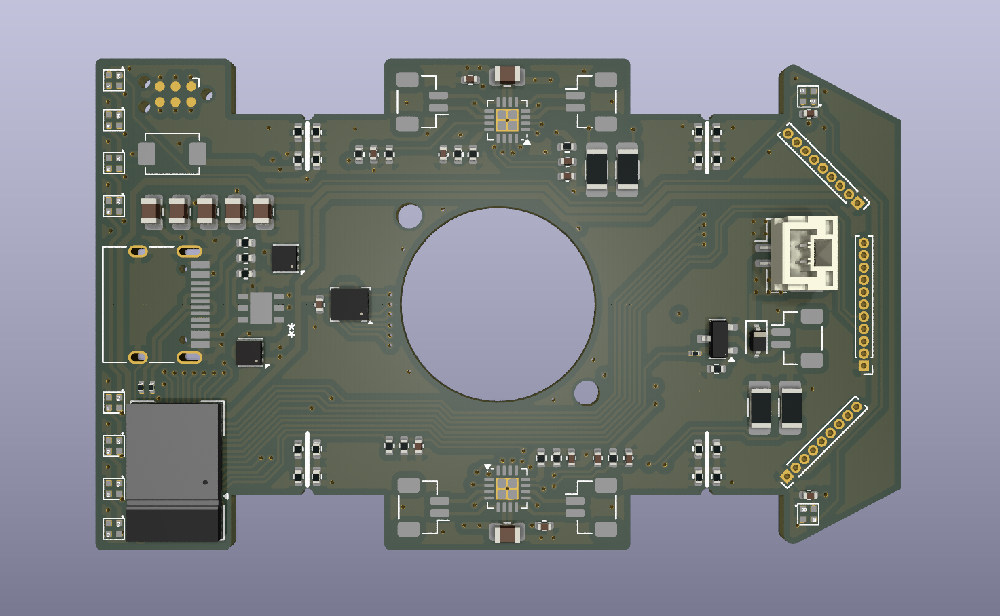

# MouseWB5 
40mm x 65.5mm Mini RC car inspired by half size micro mouse.
It is powered by the STM32WB5 precertified wireless module.
It uses STSPIN240 motor drivers to power four small coreless DC motors.
Contains the LSM6DSO as an IMU, and has headers for an additional fan motor for a suction mechanism.
SPI and I2C module connections for future VL53 lidar sensors, as well as programmable drift lights and turn signals. 
Includes a battery charging circuit and can be programmed via the TC2030 debug connector.

